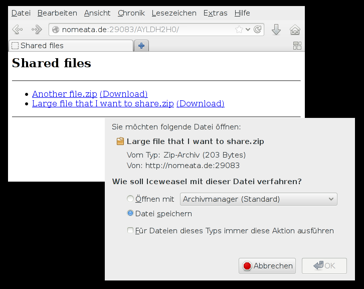

Share File
==========

This is my contribution to [XKCD #949](http://xkcd.com/949).

The role model
--------------

There exists a web service called [FileTea](http://filetea.me), which is
reallly great: Just go there with your web browser and share a file. You get a
link that you can send to other people, and they can use it to download the
file. The greatness of FileTea comes from the fact that

 * the file is streamed to the other user directly from your browser, i.e. it
   is not stored on the server, and
 * as soon as you close your browser tab, the link becomes invalid.

The idea
--------

The disadvantage of FileTea is that you need to open a browser tab and find the
file in a file open dialogue. Annoying if you were just working with the file
on the command line.

Therefore I have created a small python script, `share-file`, which

 * takes a hostname and a number of filenames as command line arguments,
 * uses `ssh`’s port forwarding feature to listen on a random port on the
   remote host,
 * shows you a link to share and
 * serves the files using a simply embedded web server to whoever opens that
   link.

For further clarification, here are some screenshots:

Screenshots
-----------

Alternatives
------------

After implementing this, I found out about
[FileTeaSend](https://github.com/brechin/FileTeaSend), a command line client
for [FileTea](http://filetea.me/). That might be the better tool.

Installation
------------

 * `git clone git://git.nomeata.de/share-file.git`
 * Put or link `share-file` somewhere in your `PATH` (or call it with its full path).
 * Optionally: Install `python-magic`.

Bugs, warts and TODOs
---------------------

 * The server needs to have `GatewayPorts clientspecified` enabled in
   `sshd_config`. This could be fixed by not using SSH’s port-forwarding, but
   by uploading some code via SSH that opens the port and multiplexes the
   communication. But that would either require some non-standard libraries or
   lots of code.
 * If the hostname you use to access the server via SSH is not publicly usable,
   you will have to manually change it before sharing the URL.
 * The script has no hard dependencies (python comes with almost all that is
   needed), but if you want the browser to receive correct `Content-Type`
   headers, e.g. to display an image directly, install `python-magic`.
 * If the randomly chosen port is not available on either the remote or the
   local host, the script will fail. Just try again.
 * The embedded web server is rather dumb, it will not support resuming
   downloads, for example. A more fancy web server could be embedded, but that
   would add dependenies.
 * The HTML output of the file index is plain and ugly; patches welcome.
 * More problems? Please report them at [the github issue tracker](https://github.com/nomeata/share-file/issues/).

Author
------

© 2013 [Joachim Breitner](http://www.joachim-breitner.de/).

